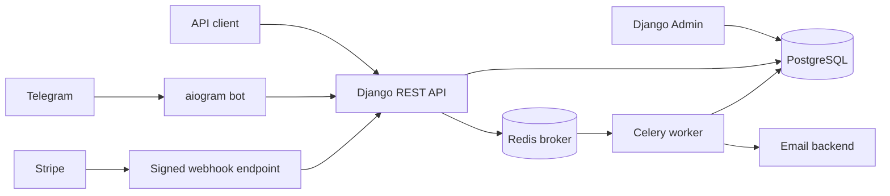
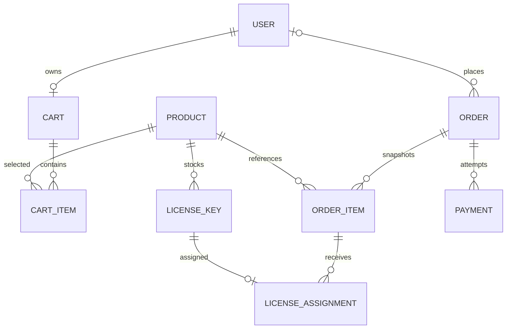
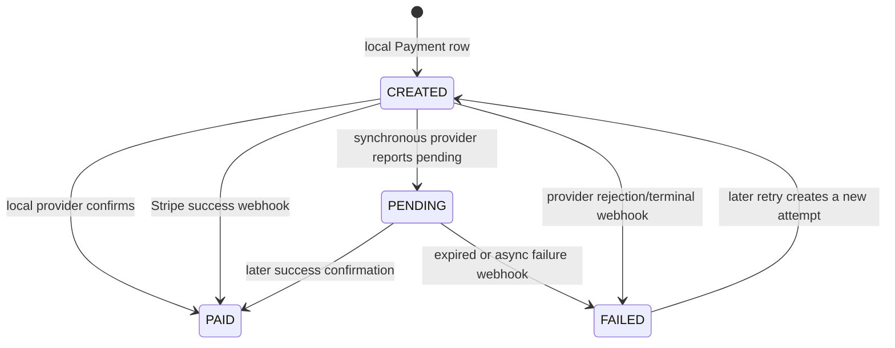
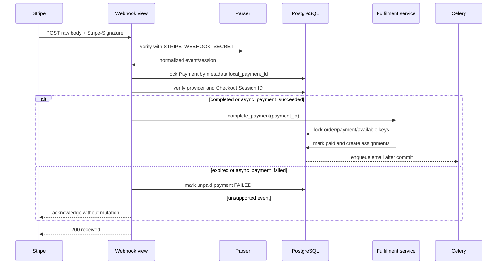

# Architecture

Ludora is a modular monolith. Django owns business rules and durable state,
PostgreSQL enforces relational and concurrency invariants, the Telegram bot is
a presentation adapter, and Celery performs post-commit work.

## Components

- `authentication` and `users` own email/Telegram identity and JWT issuance.
- `games` owns products, platforms, categories, and license-key inventory.
- `carts` owns mutable purchase intent and atomic conversion into an order.
- `orders` owns immutable item snapshots, payment records, fulfilment, and
  confirmation email.
- `payments` owns the provider interface, local simulator, Stripe Checkout
  adapter, and Stripe webhook parsing.

Transport layers remain thin: serializers validate input and shape output;
services own multi-model operations and transaction boundaries.

## Domain model

An `OrderItem` copies product title, unit price, and quantity. `Order.total_price`
is the server-calculated amount due; later catalogue changes cannot alter it.
`Order.price_paid` records the completed amount. Direct orders also retain
legacy order-level `product` and `license_key` fields for API compatibility;
cart orders and all fulfilment use normalized items and assignments.

PostgreSQL constraints protect positive quantities, non-negative financial
values, unique cart/order lines, unique transaction identifiers, and
single-use license keys. Protected foreign keys preserve commercial history.

## Cart and order lifecycle

1. A user adds active products to one persistent cart. Current catalogue prices
   are shown because a cart is mutable intent.
2. Checkout locks the cart and its items, revalidates product availability,
   calculates the total, writes immutable order-item snapshots, and clears the
   cart in one transaction.
3. Direct order creation performs the equivalent snapshot for one active
   product.
4. The order remains `CREATED` until a provider confirms payment. The model
   defines `CANCELLED`, but no cancellation command is implemented.

Order access is owner-scoped. Regular users see only their own orders; staff
can use the general order endpoints to see all orders. Private `/my/` details
include payment attempts and reveal assigned keys only for paid orders.

## Payment lifecycle

Payment creation locks the order, rejects paid orders and duplicate active
attempts, creates a local `Payment`, then calls the selected provider with an
idempotency key based on that payment ID. Stripe-backed records remain
`CREATED` while Checkout is in progress; a successful or terminal webhook
advances them directly. `PENDING` is available for a synchronous provider
confirmation that explicitly reports a non-terminal result.

The default local provider creates a deterministic `local-pay-...` reference.
The `/pay/` command synchronously confirms it and is used by the Telegram bot.

The Stripe provider creates a Checkout Session with:

- one line item for the authoritative order total;
- configured currency and success/cancel URLs;
- the order number as `client_reference_id`;
- order number and local payment ID in metadata;
- the local payment ID as the Stripe idempotency-key basis.

It returns the hosted checkout URL. Stripe confirmation is asynchronous and
must arrive through the webhook; calling `/pay/` for a Stripe payment returns a
domain error because synchronous Stripe confirmation is intentionally absent.

## Stripe webhook flow

Supported events are:

- `checkout.session.completed`
- `checkout.session.async_payment_succeeded`
- `checkout.session.async_payment_failed`
- `checkout.session.expired`

The endpoint verifies the signature before parsing application data. It then
requires a valid local payment ID, a stored `stripe` provider, and an exact
Checkout Session ID match. Invalid signatures or mismatched references return
`400`; unsupported, correctly signed event types return `200` without changes.

Fulfilment is idempotent for a payment already completed with its order: a
duplicate success webhook does not allocate another key or queue another
email. A failure/expiry event never changes a payment already marked `PAID`.
Stripe event IDs are validated but are not persisted; idempotency rests on the
locked local payment/order transition.

## Fulfilment and concurrency

Successful confirmation verifies that the payment amount equals the immutable
order total. The service locks the order and payment, selects the required
available keys with row locks, marks them sold, creates one assignment per
purchased unit, and sets a shared paid timestamp on the payment, order, and
keys. Any failure rolls back the full local transition.

Lock order is stable: cart before cart items, and order before payment and
inventory. This prevents concurrent checkouts from consuming the same cart,
duplicate active payments, and two purchases receiving the same key.

After commit, Celery reloads the order and sends a confirmation email. Broker
or SMTP failures cannot roll back payment. The current email task requires the
legacy direct-order license field, so paid cart orders are fulfilled and
visible through private order details but do not receive confirmation email.

## Deployment boundaries

Docker Compose runs PostgreSQL, Redis, Django, Celery, and the Telegram bot for
development. It does not provide a production WSGI/ASGI server, TLS, reverse
proxy, static/media hosting, backup policy, monitoring, or secret management.
The directories under `docker/` document reserved PostgreSQL and Nginx
customization; neither adds custom behavior to the current topology.

Current payment limitations include no refunds, reconciliation worker,
inventory reservation expiry, or persisted Stripe event ledger. Bot tokens and
language preferences are process-local and are lost on restart.

## Design Decisions

### Why Django

Django provides a cohesive foundation for a relational commerce system: its
ORM and migrations evolve the schema with the domain, its authentication
framework supports the custom user model, and its admin offers an operational
surface for catalogue and inventory data. Keeping these capabilities in one
framework reduces integration boundaries around security-sensitive and
transactional behavior.

### Why Django REST Framework

Django REST Framework defines the HTTP boundary without making it the owner of
business rules. It centralizes authentication, authorization, input validation,
serialization, and consistent responses while allowing command-style commerce
operations to delegate to application services.

### Why PostgreSQL

PostgreSQL is part of the correctness model, not only a persistence choice.
Transactions, row-level locks, foreign keys, uniqueness constraints, and check
constraints protect order, payment, cart, and inventory invariants across
concurrent processes. A relational database also fits the explicit ownership
and lifecycle relationships in the domain.

### Why the Service Layer Exists

Services define application operations that span models, require a deliberate
transaction boundary, or must be reusable outside one transport. They keep
lock ordering, authoritative calculations, provider orchestration, and
fulfilment out of views and serializers, while simple reads and conventional
single-model writes remain in the framework layer.

### Why Order Snapshots Are Immutable

A cart represents mutable purchase intent, but an order is a commercial
record. At order creation, product title, unit price, and quantity are copied
into `OrderItem`, and the server-calculated total is stored on `Order`; payment
and fulfilment use those values rather than the current catalogue price.

This preserves what the customer agreed to buy even if the product is later
renamed, repriced, deactivated, or otherwise changed. Protected catalogue
references retain traceability, while the snapshot remains the authoritative
historical description of the purchase.
