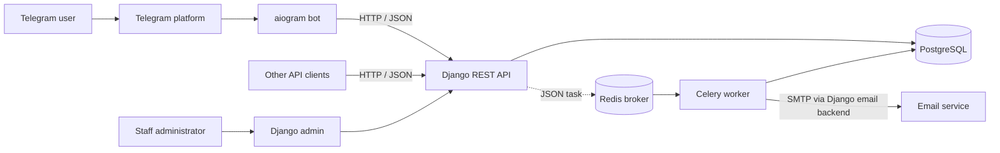
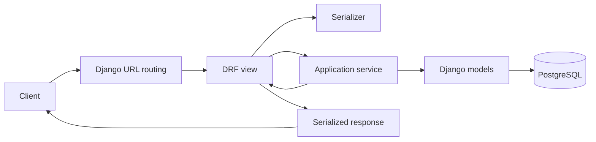
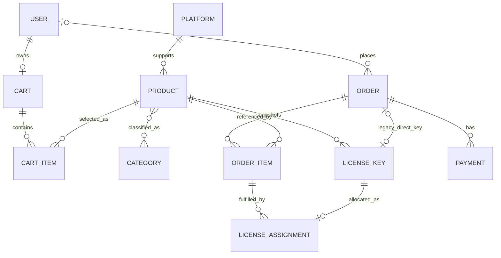
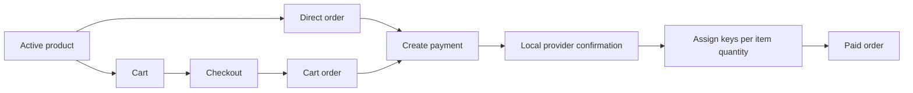
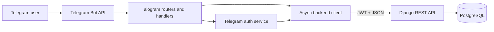

# Ludora Architecture

Ludora is a backend-focused marketplace for digital products and license keys. Its purpose is to demonstrate a small but credible commerce system: a searchable catalogue, two
authentication paths, persistent shopping carts, immutable order history, and transaction-safe payment and fulfilment rules.

The system consists of a Django REST API, PostgreSQL, a Redis-backed Celery worker, and an aiogram Telegram client. Docker Compose provides a reproducible development topology. The design favors explicit domain
boundaries, server-owned financial calculations, database-backed invariants, and thin transport layers.

This document describes the architectural decisions and guarantees of the current system. It intentionally does not serve as an endpoint reference or a
code walkthrough.

## Technology stack

### Django

Django provides the application lifecycle, ORM, migrations, authentication foundation, and administration interface. Those capabilities are particularly valuable for a relational
commerce domain: models and migrations can evolve together, staff can manage catalogue and inventory data through the admin, and security-sensitive user behavior builds on a mature
framework.

The project uses a custom Django user model from the outset. Email is the login identifier, while optional Telegram identity fields allow the same backend user domain to support the
bot channel.

## Identity, authentication, and catalogue authorization

The existing `users.User` model is the identity source. It extends Django's
`AbstractUser`, removes the username field, and uses a case-insensitively unique
email address as `USERNAME_FIELD`. Public registration accepts only email and
password credentials, confirms the password, runs Django's configured password
validators, and delegates creation to the user manager so passwords are hashed.
Staff and superuser flags are never registration inputs.

SimpleJWT is the API authentication boundary. A client registers separately,
exchanges valid email/password credentials for an access/refresh pair, and sends
the short-lived access token as `Authorization: Bearer <token>`. Refresh tokens
can obtain a new access token without resending credentials. Tokens use HS256
and Django's secret key; no separate signing secret or blacklist application is
introduced. Django's session middleware remains installed for the admin, while
DRF uses JWT authentication for API requests, avoiding session-CSRF coupling for
JWT clients.

DRF view permissions are the authorization boundary. Catalogue list and detail
views remain public and continue to hide inactive products. Create, full update,
partial update, and soft delete views share one explicit staff permission,
which rejects anonymous and authenticated non-staff callers before serializer
or business validation runs. Swagger exposes the JWT bearer scheme and marks
protected operations so the same boundary is visible in the API contract.

### Django REST Framework

Django REST Framework (DRF) is the HTTP boundary around the domain. It provides authentication and permission policies, request validation, serialization, pagination, filtering, and
consistent error responses without coupling those concerns to commerce services.

Generic views suit conventional catalogue operations. Explicit API views are used for cart and payment commands whose behavior is better expressed as an application operation than
as CRUD against one model.

### PostgreSQL

Ludora relies on PostgreSQL for more than persistence. Transactions, row-level locks, uniqueness constraints, and check constraints form part of the correctness model. Cart checkout
and payment creation must remain safe when two requests arrive concurrently; those guarantees cannot be provided reliably by process-local state.

PostgreSQL also matches the relational shape of the domain. Products, categories, carts, orders, payments, and license keys have explicit ownership and lifecycle relationships that
benefit from foreign keys and transactional updates.

### Docker

The backend, Celery worker, bot, PostgreSQL database, and Redis broker are independently orchestrated with Docker Compose. The worker reuses the backend image and source while running
a separate process. This makes the development topology explicit, keeps runtime versions reproducible, and lets containers address one another by service name.

The backend and worker entrypoint waits for PostgreSQL readiness before starting its command, while Compose also gates the worker on Redis health. Compose currently models startup
and local development; it is not a production deployment definition.

### Celery and Redis

Celery runs asynchronous work through a Redis broker. Django owns the Celery
application, discovers shared tasks from installed applications, accepts JSON
task payloads only, and does not store task results. The implemented tasks are
a bounded diagnostic worker probe and the order-confirmation email task.
Backend tests execute tasks eagerly and do not require Redis.

### aiogram

aiogram provides an asynchronous Telegram interface without moving domain state into the bot. Its router and callback-query model fits catalogue navigation and cart controls, while
its async runtime pairs naturally with the HTTPX client used to call the backend.

The bot is an API consumer. It formats messages, builds keyboards, stores short-lived authentication state, and translates user interactions into REST requests. Product, cart,
order, and payment rules remain authoritative in Django.

### drf-spectacular

drf-spectacular derives an OpenAPI schema from DRF views and serializers and serves Swagger UI for interactive exploration. Explicit response annotations document command-style
operations and their errors.

Schema tests protect the contract itself. This matters because the Telegram client consumes structured JSON and because a portfolio API should be understandable independently of its
implementation.

### pytest

pytest is used for both packages, with pytest-django integrating the backend suite and pytest-asyncio supporting the bot. The testing approach covers API contracts, domain services,
database migrations, concurrency behavior, schema generation, and bot presentation and handlers.

This breadth is intentional: commerce failures often occur at boundaries between validation, transactions, persisted history, and client behavior rather than inside isolated
functions.

### Ruff

Ruff provides fast, deterministic linting and import checks for both Python packages. Each package owns its configuration because their dependency sets and lint selections differ
slightly. Ruff is a development quality gate, while pytest verifies behavior.

## High-level architecture



The **Django backend** is the system of record. API requests own authentication,
catalogue visibility, cart mutation, order creation, simulated payment, and
license-key assignment; the Celery worker only reloads committed order state for
asynchronous email delivery.

**PostgreSQL** stores users, catalogue data, cart state, order snapshots, payments, and license-key inventory. It also arbitrates concurrent writes through constraints and row-level
locks.

The **aiogram bot** is a presentation adapter for Telegram. It uses the same API that another client could use and does not connect to PostgreSQL.

The **Django admin** is the current staff-facing management surface. It supports
catalogue management with annotated license-key inventory totals and masked key
inspection. Orders expose read-only item and payment inlines, while standalone
order and payment views protect operational fields from manual editing;
payments and sold license keys are also protected from deletion. Public and bot
clients receive only active catalogue entries.

Staff with product change permission can bulk-create license-key inventory from
the product change page by uploading a UTF-8 CSV file with a required `value`
column. The admin validates and parses the complete file before writing, trims
values, ignores empty rows and additional columns, and skips both repeated CSV
values and keys already belonging to that product. New keys are inserted in one
atomic `bulk_create` operation with `AVAILABLE` status; existing keys are never
modified. The admin reports imported, duplicate, and empty-row counts after a
successful import.

## Backend architecture

The backend is organized as a Django project plus domain applications:

```text
backend/
├── config/                  # Settings, root URLs, WSGI and ASGI entry points
└── apps/
    ├── core/                # Cross-cutting infrastructure and diagnostic tasks
    ├── authentication/      # Registration, JWT and Telegram authentication
    ├── users/               # Custom user identity and persistence
    ├── games/               # Catalogue and license-key inventory
    ├── carts/               # Mutable shopping intent and checkout
    ├── orders/              # Orders, snapshots, payments and fulfilment
    ├── payments/            # Provider contract, selection and local simulation
    └── permissions.py       # Shared staff permission
```

Domain applications keep ownership visible. `games` owns sellable products and keys; `carts` owns pre-purchase intent; `orders` owns historical purchases and payment orchestration;
`payments` owns the provider boundary and deterministic local simulation. Authentication is separate from the user model because issuing credentials and representing an identity
are different responsibilities.

The split avoids one undifferentiated application while remaining a modular monolith. All domains share one Django process and one database, so cross-domain transactions are
straightforward. This is appropriate for the current scale: the system gains clear boundaries without distributed transactions or operational complexity.

The implemented `Payment` model and orchestration services remain in `orders`,
where they participate in the order and licence fulfilment transaction. The
provider code deliberately has no Django model, DRF, email, Celery, inventory,
or user dependencies.

## Request lifecycle



1. **URL routing** selects a view for the resource or command.
2. The **DRF view** applies authentication and authorization, coordinates HTTP
   status codes, and translates expected domain errors into responses.
3. A **serializer** validates untrusted input and shapes output. It does not
   accept client-calculated prices or totals.
4. An **application service** executes a business operation such as adding an
   item, checking out a cart, creating a direct order, or paying an order.
5. **Models and PostgreSQL** persist the result and enforce final invariants.

Simple read paths and conventional catalogue writes do not need a service solely for symmetry. Their behavior is adequately represented by DRF generic views, serializers, and model
constraints.

Transactional commerce operations do use services. A serializer should not decide lock order, allocate inventory, or coordinate several model writes; a view should not become the
only place where an order can be created safely. Services make those rules reusable, testable without HTTP, and explicit about their transaction boundary.

## Domain model



`Product` is the catalogue aggregate, attached to one `Platform` and zero or more `Category` records. It also owns the inventory of `LicenseKey` records.

A `User` may own one persistent `Cart`. Each `CartItem` identifies one product and a quantity. An `Order` belongs to a user when that account still exists, and its `OrderItem`
children preserve what was purchased. Payments are attempts or completed
financial records associated with an order. Each `LicenseAssignment` links one
sold `LicenseKey` to an `OrderItem`; an item has one assignment per purchased
unit, while the one-to-one key relationship prevents the same key from being
allocated twice. Paid direct and cart orders use these normalized assignments.
The legacy direct-order `license_key` field is also populated for backward
compatibility.

Some foreign keys deliberately use `PROTECT`: catalogue records referenced by orders or fulfilment cannot be removed casually. A user's deletion uses `SET_NULL` on orders so
commercial history can survive independently of the account.

## Catalogue

Products represent games and other supported digital product types. A product belongs to a platform and may belong to multiple categories. Catalogue reads use eager loading for
platform and category relationships to keep query counts bounded.

The list endpoint supports exact filtering by platform, product type, and category. Text search spans title and description. Ordering is restricted to price, title, or creation
time, with title as the default. DRF page-number pagination returns ten products per page.

Only active products appear in public list and detail queries, and direct order input resolves only against active products. Deletion is therefore a soft deactivation rather than
physical removal. This protects relationships and removes unavailable items from future purchases without erasing history.

An existing cart may outlive a product's active state. Checkout revalidates every product and rejects the entire operation if any item is no longer available, preserving the cart so
the user can resolve it.

## Shopping cart

`Cart.user` is one-to-one, establishing at most one persistent cart per user. The cart is created lazily, and a uniqueness constraint is the final guard if concurrent requests race
to create it.

Within a cart, `(cart, product)` is unique. Adding an existing product increases its quantity rather than creating a duplicate line. Quantities must remain between 1 and 99,
enforced by request validation, model validation where appropriate, and a database check constraint.

Cart totals are derived from current product prices on every representation. They remain mutable by design because a cart expresses purchase intent, not an accounting event. If a
catalogue price changes before checkout, the displayed cart total changes with it.

Checkout is the boundary where mutable intent becomes history. The service locks the cart and its items, rechecks availability, calculates the server-authoritative total, creates
the order and item snapshots, then clears the cart in one transaction. Checkout does not trust prices supplied by a client.

## Order lifecycle



A **DIRECT order** represents the original single-product purchase path. It
stores the legacy product reference and also creates one normalized `OrderItem`
snapshot. Payment fulfilment creates a normalized license assignment and also
populates the legacy order-level key field.

A **CART order** represents a multi-line checkout. Its products are represented
only by `OrderItem` records; the legacy product field must be null. Checkout
creates the order in `CREATED` state and performs no payment or key assignment.
The payment service can subsequently allocate one available key for every unit
of every item and records those relationships as `LicenseAssignment` rows.

Both sources exist to preserve the legacy direct-order API while the model
evolves around normalized multi-item orders. The source discriminator makes
their differing structural invariants explicit.

The model also defines `CANCELLED`, but the current application exposes no cancellation workflow.

### Order-history authorization

`Order.user` is the ownership boundary for authenticated order history. The
`GET /api/orders/` and `GET /api/orders/<id>/` views begin with the same scoped
queryset: regular users receive only rows whose owner is `request.user`, while
authenticated staff receive all rows, including guest orders. Detail lookup
runs against that queryset, so another user's order and a nonexistent order
both produce `404`; this prevents order identifiers from becoming an existence
oracle. The list uses standard page-number pagination and deterministic
`created_at`, then primary-key, descending order.

The canonical history serializer reads immutable `OrderItem` snapshots and deliberately
omits the owner, customer email, payment records, and assigned license key.
Prefetching those item snapshots bounds list and detail queries without joining
unserialized users, payments, or key inventory. License delivery remains in the
existing successful direct-payment response and post-commit transactional
email, rather than being broadened into a long-lived history response. Separate
owner-scoped `/api/orders/my/` endpoints provide personal summaries and details;
the detail representation includes payments and reveals normalized license
assignments only for paid orders.

Authenticated direct creation and cart checkout already derive ownership from
`request.user`; clients cannot submit an owner. Orders with `user=None` remain
guest records. Matching a guest order's email to a later account does not prove
ownership, so retrospective email-based claiming is deferred until a separate
verification and threat model exists.

## Immutable snapshots

`OrderItem` is the stable record of what the customer agreed to buy. An order cannot rely on joining back to the current product row for its commercial meaning because catalogue
data is mutable.

The product title is copied into `product_title`. A staff member may rename a game after purchase, but an order history page must continue to show the title that appeared at
checkout. For example, a regional edition could later be renamed or consolidated without rewriting old receipts.

The price is copied into `unit_price`. A sale ending tomorrow must not make yesterday's order more expensive, and a later discount must not retroactively reduce a recorded
obligation. Quantity and unit price together preserve each line's financial basis.

`Order.total_price` stores the authoritative aggregate at order creation. Payment uses this value, not the live product price. This prevents the interval between order creation and
payment from changing the amount charged. `price_paid` separately records the amount actually completed by the simulated payment flow.

The product foreign key remains useful for traceability and fulfilment, but it is not the source of historical title or price. Snapshot fields are the source for order presentation,
and protected product deletion prevents dangling commercial references.

Historical orders must not change when:

- staff edits a product title or price;
- a promotion starts or ends;
- catalogue visibility changes;
- a user views an order months after checkout;
- payment occurs after a catalogue update.

The normalization migration backfills legacy direct orders conservatively. It prefers an existing order total, then recorded paid amounts, completed payment records, or existing
item snapshots. Only an unpaid legacy order may fall back to the current catalogue price. Ambiguous records remain unresolved for manual review rather than receiving invented
financial data.

## Payments

Payment handling has two related operations. `create_payment` creates a
`CREATED` payment record for an eligible, owned direct order, asks the selected
provider to create its provider-side representation, and stores the provider
name and safe reference in existing model fields. It snapshots the order's
authoritative total and prevents another active `CREATED` or `PENDING` payment.

The provider contract accepts a small immutable creation request and returns an
immutable provider payment containing only an external identifier and normalized
`PENDING`, `SUCCEEDED`, or `FAILED` status. It never receives an `Order`, user,
request, license key, or serializer. `get_payment_provider()` selects the
internal `PAYMENT_PROVIDER` Django setting for new transactions or resolves an
explicit stored name for existing transactions. Unsupported or empty explicit
names never fall back to the default. Services also accept an explicit provider,
making the boundary replaceable in tests without mutable global state.

`LocalPaymentProvider` is the default. It deterministically derives a synthetic
`local-pay-...` reference from the service idempotency key, needs no credentials
or network, and deterministically confirms or rejects. It is simulation only,
not a gateway or production payment integration.

`pay_order` reuses an active payment where one exists or creates one for the
backward-compatible direct-pay command. A payment with a provider transaction is
always confirmed through its stored provider; injected providers must have the
same name. Missing, unsupported, or mismatched provider ownership is rejected
with a stable domain error. Only the order service interprets the normalized
result. On success it locks the required available license keys for every
order-item quantity, marks them sold, creates normalized assignments, marks the
payment and order paid, and records the shared paid timestamp. Direct orders
also retain their first assigned key in the legacy order-level field.
On rejection the payment becomes `FAILED` while the order and inventory remain
unchanged, allowing the established retry behavior.

The orchestration service owns `transaction.atomic`, row locks, local state
changes, and post-commit work. If validation fails, inventory is unavailable,
the provider raises, or a database write fails, local changes roll back. A
license key cannot be consumed while leaving the order unpaid. The local
provider call is currently inside this transaction because it is in-process and
non-blocking. A future network provider must use a phased flow so database locks
are not held across slow network I/O.

After `pay_order` completes its database writes, it registers a
`transaction.on_commit` callback with only the immutable order primary key.
Only a successful outermost commit publishes the Celery confirmation task. The
worker reloads committed order state, verifies that the order and a payment are
paid and that the legacy direct-order key and paid amount exist, builds a
plain-text confirmation, and sends it through Django's configured email
backend. The task retries `OSError` and SMTP failures with backoff, jitter, and
at most three retries. Missing or ineligible orders are logged and skipped.
Because eligibility and message construction still use the legacy order-level
key, paid cart orders are fulfilled but do not receive this email. Broker and
email failures occur after commit and cannot roll back a completed payment.

The locked transition from an unpaid order to `PAID` prevents repeated payment
requests from scheduling another confirmation. This is dispatch idempotency,
not complete delivery idempotency: broker redelivery or a retry after an
ambiguous SMTP outcome could still send a duplicate. A stronger delivery ledger
or provider idempotency mechanism is deferred to a later milestone.

There is no external payment provider. The abstraction adds no gateway SDK,
credentials, redirect, webhook, refund, or reconciliation behavior. Webhooks
and asynchronous reconciliation are deferred until a real provider and its
state machine exist.

## Concurrency

Commerce operations serialize around stable parent records. Cart mutations and checkout lock the cart before locking or changing its items. This common lock order makes the cart the
coordination point for competing requests.

During checkout, `select_for_update` prevents two requests from consuming the same cart contents. One request creates the order and clears the lines; the other observes an empty
cart. Concurrent quantity changes are either included in the snapshot or receive a not-found outcome after checkout, without silently losing purchased quantity.

Payment creation locks and reloads the order before checking its current status and active payments. This prevents two concurrent requests from both passing a stale precondition and
creating duplicate in-progress payments.

Payment confirmation locks the order, an active payment when present, and the
selected available license key. That prevents duplicate payment of one order,
duplicate email scheduling, and two sales from allocating the same key.

Lock ordering matters because transactions touching the same rows in different orders increase deadlock risk. The current services consistently acquire the cart or order first, then
dependent rows. Database uniqueness constraints remain the final safeguard for one cart per user and one product line per cart.

## Database integrity

Application validation provides helpful client errors, but PostgreSQL enforces invariants even if data is written through admin actions, migrations, a shell, or concurrent requests.

Financial constraints require non-negative product prices, order totals, recorded paid prices, order-item unit prices, and payment amounts. Quantity constraints require positive
order-item quantities and cart quantities from 1 through 99.

Uniqueness constraints establish:

- one cart per user;
- one line per product in a cart;
- one line per product in an order;
- unique order numbers;
- unique payment transaction identifiers when present;
- unique Telegram identities;
- case-insensitively unique email addresses;
- at most one normalized assignment per license key.

The order source constraint ensures cart orders do not use the legacy single-product field. Foreign-key deletion policies preserve order and licence history where losing the
referenced record would be unsafe.

Constraint migrations validate existing rows before tightening the schema. Historical backfill has dedicated migration tests, including precedence among possible financial sources
and intentionally unresolved records. This treats data evolution as part of the architecture rather than a one-time operational script.

## Telegram bot



On `/start`, the bot sends the Telegram identity to an internal authentication endpoint using a shared secret. Django atomically creates or synchronizes the user and returns a JWT
access/refresh pair. Protected bot operations then use the access token.

Tokens are held in an asynchronous, process-local store keyed by Telegram ID. After a protected request returns `401`, the client attempts one token refresh and retries once. If
authentication still fails, the stored tokens are removed; the authentication service can synchronize the Telegram identity again.

Catalogue browsing is public and paginated. Handlers obtain products from the API and render localized messages and inline keyboards. The bot supports English and Russian
presentation.

Cart controls call authenticated backend operations to add, update, remove, or
clear items. Callback payloads include an owner identifier so another Telegram
user cannot operate controls from a shared message. Checkout requires
confirmation, creates an order, then attempts to create a payment. The bot
expects a hosted `payment_url`, but the backend payment representation has no
such field and the local provider exposes no hosted page, so this payment
handoff is not currently end to end.

The bot also exposes personal order summaries and details. Paid detail responses
can render payment metadata and normalized license keys. This makes order
history and key presentation implemented, but immediate post-checkout delivery
remains dependent on completing the payment lifecycle.

The bot deliberately contains no ORM models or business calculations. Its API schemas validate backend responses, and its exception mapping converts transport, authentication,
validation, conflict, and malformed-response conditions into user-facing behavior.

## Testing strategy

The backend and bot have independent pytest suites because they are separately packaged applications with different runtime concerns.

**API tests** exercise authorization, ownership, catalogue visibility, filtering, pagination, validation, response shape, and complete cart and order flows through DRF.

**Service tests** exercise payment eligibility, immutable pricing, inventory assignment, rollback behavior, and failure paths without relying on HTTP.

**Migration tests** move historical schemas forward and verify that direct orders receive trustworthy totals and item snapshots without fabricating missing data.

**Schema tests** generate OpenAPI and assert that request, success, pagination, and error schemas match the actual endpoints. Authentication schemas receive the same contract-level
coverage.

**Concurrency tests** use transactional test cases, separate database connections, thread barriers, and PostgreSQL row-lock support. They verify checkout races, mutation during
checkout, and competing payment creation.

**Celery tests** verify configuration, task discovery, eager execution, the
diagnostic probe, confirmation-email eligibility and content, retry behavior,
and post-commit dispatch without contacting an external broker.

**Bot tests** cover configuration, authentication and token refresh, the async API client, response schemas, handlers, callback keyboards, localization, and presentation. External
HTTP and Telegram behavior can therefore be simulated without a running bot.

Every important business flow has tests because its guarantee crosses several layers. A successful checkout, for example, requires correct authorization, locking, price calculation,
snapshots, cart clearing, response serialization, and rollback semantics.

## Design decisions

### Why a service layer?

Services define transaction boundaries around multi-model commands. They keep views focused on HTTP and serializers focused on validation and representation. They also provide one
tested path for rules that may later be called by an API view, an admin action, or a background worker.

### Why immutable snapshots?

Catalogue data answers “what is sold now”; an order answers “what was agreed then.” Copying title, unit price, quantity, and aggregate total prevents mutable catalogue state
from corrupting receipts, payment amounts, or support records.

### Why PostgreSQL?

The design needs relational constraints, atomic multi-row changes, and real row-level locks. PostgreSQL supplies those guarantees and lets concurrency be resolved where all
application instances share state.

### Why DRF?

DRF provides a consistent authentication, permission, validation, pagination, and serialization boundary for both the Telegram bot and future clients. It also integrates directly
with the Django model and OpenAPI ecosystem.

### Why domain apps?

Domain apps express ownership and keep catalogue, identity, cart, and order concerns navigable. They allow the modular monolith to evolve by business capability without prematurely
distributing the system.

### Why Docker?

Docker makes Python dependencies, PostgreSQL, network names, and startup behavior reproducible across development environments. Separate backend and bot images preserve the fact
that they are independently runnable processes.

### Why simulated payment instead of Stripe?

The current stage focuses on order consistency, immutable pricing, locking, and licence fulfilment before introducing a provider's asynchronous state machine. Simulation makes those
domain rules demonstrable and testable, but it is not a substitute for production payment processing.

## Current limitations

The following limitations are visible in the current repository:

- no external payment provider or provider SDK;
- the Telegram checkout payment contract is incomplete: the bot requires a
  `payment_url` that the backend does not return;
- the local provider has no hosted checkout, webhook, or independently
  advancing payment-status flow;
- paid cart orders can be fulfilled, but their confirmation email task is
  skipped because it still requires the legacy direct-order key field;
- no refunds, cancellations, or returns workflow;
- no payment webhooks or reconciliation;
- no payment reconciliation worker;
- no Redis or shared bot token/session storage;
- bot tokens and language preferences are lost on restart and cannot be shared
  safely across bot replicas;
- no inventory reservation timeout or checkout reservation lifecycle;
- paid keys can be displayed in owner-scoped bot order details, but immediate
  checkout-to-payment-to-delivery is not operational end to end;
- no production deployment configuration or automated deployment pipeline;
- the GitHub Actions workflow validates the backend and bot independently;
- no application monitoring, tracing, or structured observability stack;
- no explicit API rate limiting.

These are boundaries of the current implementation, not hidden features implied by placeholder fields or directories.

## Future evolution

A realistic next step is to finish the backend-to-bot payment contract, then
implement a real gateway behind the provider contract. Payment creation would
initiate its transaction without holding database locks across network I/O,
while authenticated, idempotent webhooks would advance local state and
reconcile ambiguous results. Multi-item cart fulfilment already exists; gateway
confirmation should drive that service safely.

Celery already keeps confirmation-email delivery outside request latency.
Additional tasks could handle provider reconciliation and other retryable work;
Redis would remain the broker and could also provide shared short-lived bot
state, while durable commerce state remains in PostgreSQL.

Inventory could evolve from immediate key selection to explicit reservations with expiry. Reservation creation, checkout, payment confirmation, and timeout release would require a
documented state machine and periodic cleanup.

The direct-order email path and owner-scoped Telegram key presentation can be
extended into consistent multi-item paid-order delivery. Delivery should be
idempotent and auditable so retries do not send conflicting fulfilment messages.

The admin could gain inventory summaries, payment diagnostics, and guarded order-support actions. Refund and cancellation workflows would require explicit state transitions and
compensating inventory rules rather than direct field editing.

The CI workflow validates both applications, including migration consistency; it could later expand to generate OpenAPI before building immutable images, and a CD stage could promote
those images. Production deployment would add secret management, TLS termination, static/media handling, database backup and restore procedures, and a production application
server.

Finally, structured logs, metrics, traces, error reporting, health checks, and alerts would make transaction failures and provider latency observable. Rate-limiting and abuse
controls should be introduced at both the public API and Telegram interaction boundaries.
